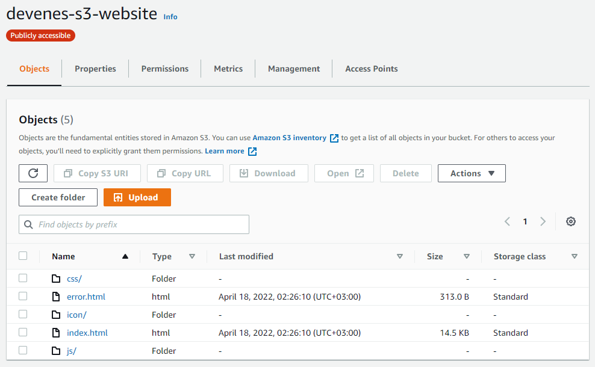
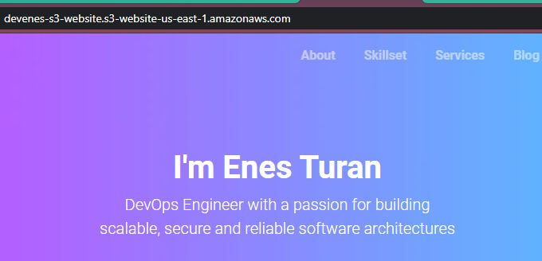

# Deploying Website on AWS S3 Bucket with Terraform

A Terraform module for publishing static websites on AWS S3.

Requires the following:

| File         | Description                                  |
| :----------- | :------------------------------------------- |
| `index.html` | The homepage of the website.                 |
| `error.html` | The page shown when errors occur.            |
| `script.js`  | A JavaScript file that is run on every page. |
| `style.css`  | A CSS file that is run on every page.        |
| `icon`       | An icon file that is used in the browser.    |

## Inputs

`bucket_name`: The name of the AWS S3 bucket this website will be published to.

- Your bucket name must be globally unique.

## Outputs

`website_endpoint`: The public url of this website.

